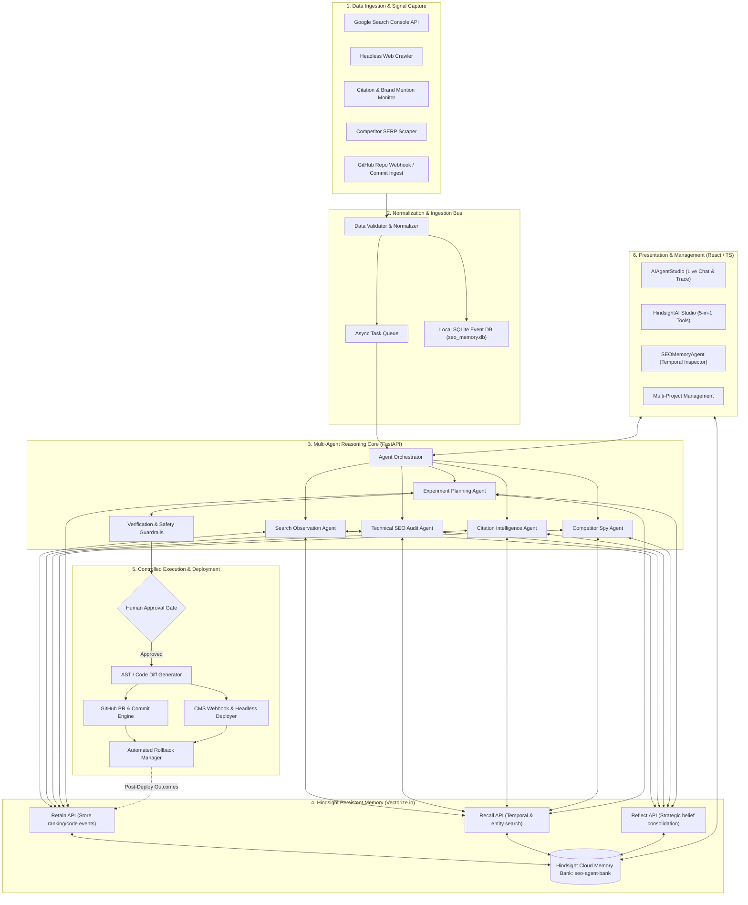
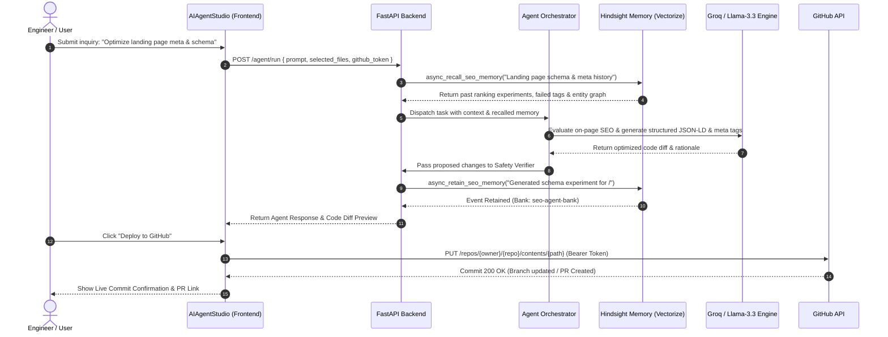
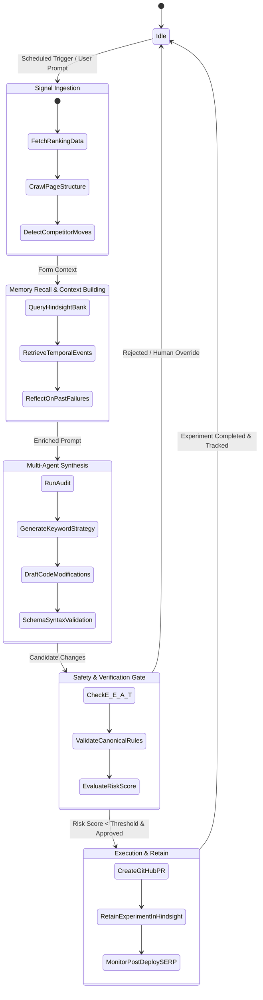
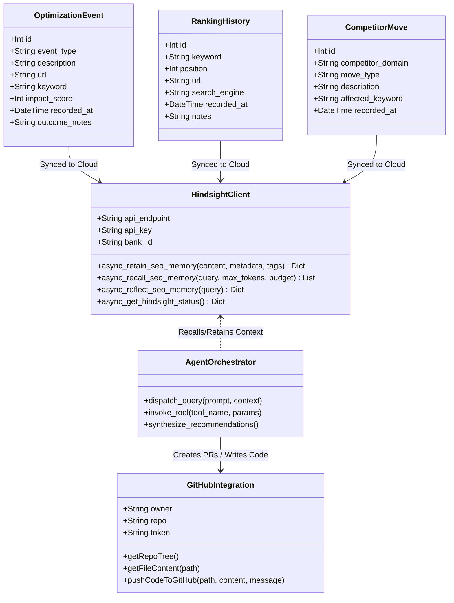

# WarpIndex — Full Project Architecture & UML Block Diagrams

This document contains comprehensive engineering specifications, block diagrams, and UML diagrams for the **WarpIndex (Hindsight SEO & Citation Agent)** platform.

---

## 1. High-Level System Block Diagram



---

## 2. UML Component Diagram

```mermaid
componentDiagram
    package "Frontend (React + Vite + Tailwind)" {
        [AIAgentStudio Component] as UI_Studio
        [HindsightAI Component] as UI_Hindsight
        [SEOMemoryAgent Component] as UI_Memory
        [GitHub Client (lib/github.ts)] as UI_GitClient
    }

    package "Backend API (FastAPI)" {
        [REST API Router (main.py)] as APIRouter
        [Agent Orchestrator] as Orchestrator
        [Hindsight Memory Client (memory/hindsight.py)] as HindsightClient
        [Local SQLite Engine (seo_memory_agent.py)] as SQLiteEngine
        [LLM Model Router (Groq / OpenAI)] as LLMRouter
    }

    package "Specialized Agent Workers" {
        [Search Observation Agent] as Agent_Obs
        [SEO Audit Agent] as Agent_Audit
        [Citation Agent] as Agent_Cite
        [Competitor Agent] as Agent_Comp
        [Experiment Planner] as Agent_Plan
        [Safety Guardrail] as Agent_Safe
    }

    package "External Services" {
        database "Vectorize.io (Hindsight Cloud)" as Ext_Hindsight
        database "SQLite (seo_memory.db)" as Ext_SQLite
        cloud "GitHub REST API" as Ext_GitHub
        cloud "Groq Llama-3.3 / GPT-OSS" as Ext_Groq
    }

    %% Frontend to Backend
    UI_Studio --> APIRouter : HTTP POST /agent/run
    UI_Hindsight --> APIRouter : HTTP POST /hindsight/*
    UI_Memory --> APIRouter : HTTP GET/POST /memory/*
    UI_Studio --> UI_GitClient : Direct repo inspections
    UI_GitClient --> Ext_GitHub : Octokit / REST API (with Bearer Token)

    %% Backend internals
    APIRouter --> Orchestrator
    APIRouter --> HindsightClient
    APIRouter --> SQLiteEngine
    
    Orchestrator --> Agent_Obs
    Orchestrator --> Agent_Audit
    Orchestrator --> Agent_Cite
    Orchestrator --> Agent_Comp
    Orchestrator --> Agent_Plan
    Agent_Plan --> Agent_Safe

    %% Agents to LLM & Storage
    Agent_Obs & Agent_Audit & Agent_Cite & Agent_Comp & Agent_Plan --> LLMRouter
    LLMRouter --> Ext_Groq
    HindsightClient --> Ext_Hindsight : Async SDK (Retain/Recall/Reflect)
    SQLiteEngine --> Ext_SQLite
```

---

## 3. UML Sequence Diagram: End-to-End Optimization Flow



---

## 4. UML Activity / State Machine Diagram



---

## 5. UML Class & Entity Relationship Diagram



---

## 6. Data Flow Diagram (DFD Level 1)

```
 [Google Search Console / SERP]
               │
               ▼ (Raw Performance Metrics)
    ┌──────────────────────┐
    │ 1.0 Signal Ingestion │ ────► [(DB: SQLite seo_memory.db)]
    └──────────────────────┘
               │
               ▼ (Normalized SEO Records)
    ┌──────────────────────┐
    │ 2.0 Memory Retain &  │ ◄───► [(Hindsight Vectorize Memory Bank)]
    │     Recall Engine    │
    └──────────────────────┘
               │
               ▼ (Temporal & Entity Enriched Context)
    ┌──────────────────────┐
    │ 3.0 Agent Synthesis  │ ◄───► [(Groq / Llama-3.3 LLMs)]
    │     & Plan Generator │
    └──────────────────────┘
               │
               ▼ (Proposed Diff / Schema Markup)
    ┌──────────────────────┐
    │ 4.0 Verification &   │
    │     Safety Check     │
    └──────────────────────┘
               │
               ▼ (Approved Patch)
    ┌──────────────────────┐
    │ 5.0 GitHub Action &  │ ────► [Target GitHub Repository]
    │     PR Deployment    │
    └──────────────────────┘
```
