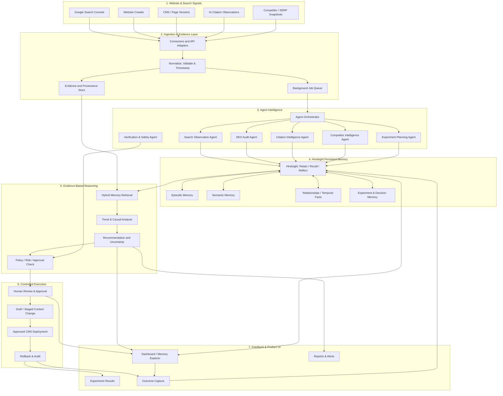

# WarpIndex - Full System Architecture

This document outlines the prototype engineering design and full system architecture of the WarpIndex SEO & Citation Agent.

## Architecture Diagram

```mermaid
flowchart TB
    subgraph INPUT["1. Website & Search Signals"]
        GSC["Google Search Console"]
        CRAWL["Website Crawler"]
        CMS["CMS / Page Versions"]
        CIT["AI Citation Observations"]
        COMP["Competitor / SERP Snapshots"]
    end

    subgraph INGEST["2. Ingestion & Evidence Layer"]
        CON["Connectors and API Adapters"]
        NORMAL["Normalize, Validate & Timestamp"]
        QUEUE["Background Job Queue"]
        EVID["Evidence and Provenance Store"]
    end

    subgraph AGENTS["3. Agent Intelligence"]
        ORCH["Agent Orchestrator"]
        OBS["Search Observation Agent"]
        AUDIT["SEO Audit Agent"]
        CITE["Citation Intelligence Agent"]
        COMPAG["Competitor Intelligence Agent"]
        PLAN["Experiment Planning Agent"]
        VERIFY["Verification & Safety Agent"]
    end

    subgraph MEMORY["4. Hindsight Persistent Memory"]
        HIN["Hindsight: Retain / Recall / Reflect"]
        EP["Episodic Memory"]
        SEM["Semantic Memory"]
        REL["Relationships / Temporal Facts"]
        EXP["Experiment & Decision Memory"]
    end

    subgraph REASON["5. Evidence-Based Reasoning"]
        RET["Hybrid Memory Retrieval"]
        CAUSAL["Trend & Causal Analysis"]
        RANK["Recommendation and Uncertainty"]
        GUARD["Policy / Risk / Approval Check"]
    end

    subgraph ACTION["6. Controlled Execution"]
        HUMAN["Human Review & Approval"]
        DRAFT["Draft / Staged Content Change"]
        DEPLOY["Approved CMS Deployment"]
        ROLL["Rollback & Audit"]
    end

    subgraph FEEDBACK["7. Feedback & Product UI"]
        DASH["Dashboard / Memory Explorer"]
        EXPUI["Experiment Results"]
        ALERT["Reports & Alerts"]
        LEARN["Outcome Capture"]
    end

    GSC --> CON
    CRAWL --> CON
    CMS --> CON
    CIT --> CON
    COMP --> CON

    CON --> NORMAL --> QUEUE
    NORMAL --> EVID

    QUEUE --> ORCH
    ORCH --> OBS
    ORCH --> AUDIT
    ORCH --> CITE
    ORCH --> COMPAG
    ORCH --> PLAN

    OBS --> HIN
    AUDIT --> HIN
    CITE --> HIN
    COMPAG --> HIN
    PLAN --> HIN

    HIN <--> EP
    HIN <--> SEM
    HIN <--> REL
    HIN <--> EXP

    HIN --> RET
    EVID --> RET
    RET --> CAUSAL --> RANK --> GUARD
    VERIFY --> GUARD

    GUARD --> HUMAN
    HUMAN --> DRAFT --> DEPLOY --> ROLL
    HUMAN --> DASH
    ROLL --> LEARN
    LEARN --> HIN

    RANK --> DASH
    HIN --> DASH
    RANK --> ALERT
    ROLL --> EXPUI
    DASH --> LEARN
```
